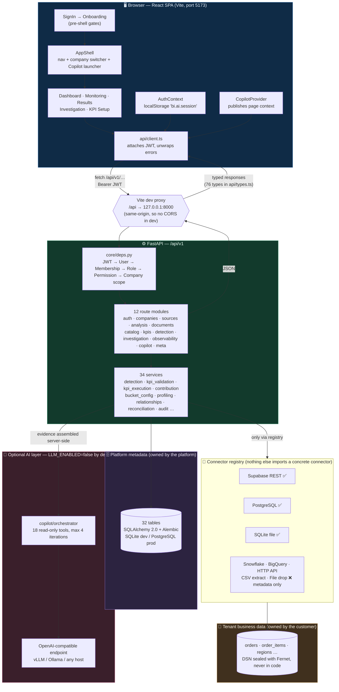
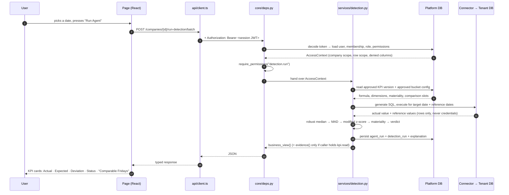
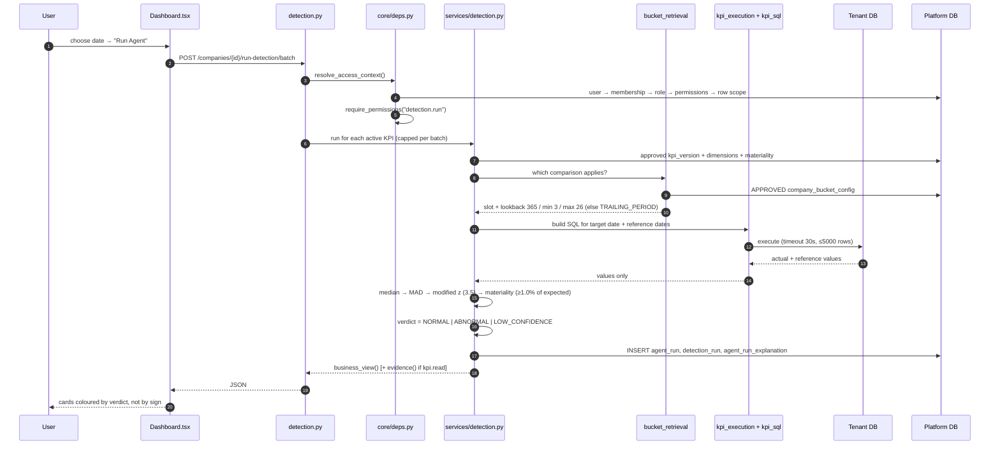
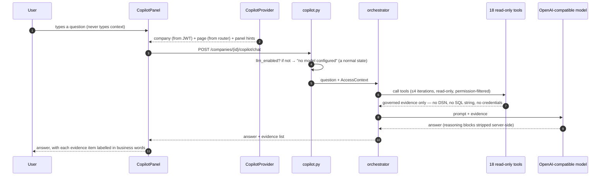
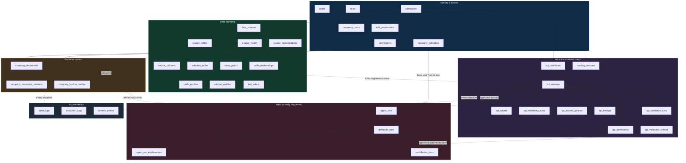

# BusinessIntelligence.ai — Complete Application Walkthrough

> A guided tour of this codebase for someone who has never seen or used it before.
> Everything below was written by reading the actual source. Where the older
> documents in `docs/` and `README.md` disagree with the code, the code wins and
> the difference is called out.

**Document status:** current as of the `frontend` branch.
**Verified test state at the time of writing:** backend **167 tests, all passing**;
frontend **47 tests — 37 passing, 10 failing**, all ten pre-existing failures inside
`frontend/src/investigation-business-view.test.tsx`.

---

## Table of Contents

1. [Application Overview](#1-application-overview)
2. [High-Level Architecture](#2-high-level-architecture)
3. [Complete User Journey](#3-complete-user-journey)
4. [Page-by-Page Walkthrough](#4-page-by-page-walkthrough)
5. [Feature-by-Feature Explanation](#5-feature-by-feature-explanation)
6. [Data Flow](#6-data-flow)
7. [How Everything Is Connected](#7-how-everything-is-connected)
8. [Root-Level Technical Structure](#8-root-level-technical-structure)
9. [Key Technical Decisions](#9-key-technical-decisions)
10. [How to Demonstrate This Application](#how-to-demonstrate-this-application)
11. [Quick Reference Summary](#11-quick-reference-summary)

---

## 1. Application Overview

### In one sentence

**BusinessIntelligence.ai is a governed KPI intelligence platform: it connects to a
company's own business data, learns what each KPI officially means, and then answers
one question per KPI per day — *did this number behave normally?* — and when the answer
is no, it shows which part of the business the movement came from.**

### Explained without any technical words

Imagine you run an online store. Every morning someone sends you a number: *"Yesterday's
revenue was ₹18.2 lakh."*

That number, on its own, is useless. Is ₹18.2 lakh good? It depends on things a
spreadsheet does not know:

- Yesterday was a **Friday**. Fridays are always busier than Tuesdays, so comparing it
  to the day before is meaningless.
- Last month you ran a **sale**. Comparing to that week makes today look like a disaster.
- Your finance team and your marketing team **define "revenue" differently** — one
  subtracts refunds, the other doesn't. They argue about whose dashboard is right.
- Even if the number *is* unusual, nobody can tell you **which region, category or store**
  caused it without a day of manual spreadsheet work.

This application fixes exactly those four problems:

1. It compares yesterday to **the right yesterdays** — comparable Fridays, comparable
   weeks of the month, the same season last year — and it learns which comparison to use
   from the company's *own written documents*, reviewed and approved by a person.
2. It gives a **verdict in plain language**, not just a number: *Normal*, *Abnormal*, or
   *Not enough comparable history to judge*.
3. Every KPI is a **signed-off definition** that had to survive nine automatic checks
   (does the formula parse, do the columns exist, does it double-count, does it reconcile
   against the source?) before anyone was allowed to approve it.
4. When something *is* abnormal, one click breaks the movement down and tells you
   *"South region accounts for 61% of this movement"* — arithmetic done on the server
   from real rows, never a guess.

And it does all of this **without pretending to be magic**. There is no black-box model
deciding your business is broken. The maths is deterministic: the same data always
produces the same verdict, and every verdict can be traced back to the exact reference
dates it was compared against.

### The main problem it solves

| The problem | How the platform answers it |
| --- | --- |
| Dashboards show numbers but never say whether a number is *fine* | A deterministic detection engine returns one of three verdicts per KPI per date |
| "Compared to what?" is usually unanswered or answered badly | Five governed comparison slots (business event, same weekday, same week-of-month, same month/season, year-over-year) plus a documented trailing fallback |
| Every team defines the same KPI differently | KPIs are versioned contracts with an approval lifecycle, not free-text SQL |
| Anomaly tools are unexplainable, so nobody trusts them | Robust median + MAD + modified z-score — no training, no model weights, fully reproducible |
| "Why did it move?" takes a human a day of spreadsheet work | Contribution analysis apportions a stored movement across the KPI's approved dimensions |
| BI tools leak data across tenants and roles | Every request re-derives company scope and permissions from the database; row scope and denied columns are enforced per role |
| AI assistants hallucinate business numbers | The Copilot is off by default, cannot compute, and may only call 18 read-only tools over already-governed data |

### The key value it provides

- **A verdict, not a number.** `NORMAL`, `ABNORMAL`, `LOW_CONFIDENCE` — and nothing else,
  because a fourth status would be a hedge.
- **The comparison stated in words.** "Comparable Fridays" appears next to the verdict, so
  a reader can agree or disagree with it.
- **Governance you can point at.** Nine validation checks, an approval lifecycle, published
  catalog versions, and a full audit trail.
- **Explainability by construction**, not as a feature bolted on afterwards.
- **Contribution without causation.** The platform says "accounts for" and "associated
  with" — never "caused by" — because a share is not a cause.
- **Tenant and role safety as a design property**: platform metadata and tenant business
  data are kept in physically separate databases.

### Who it is for

| User | What they do here | Where they spend their time |
| --- | --- | --- |
| **Business owner / Executive** | Asks "did my KPIs behave normally?" | Dashboard, Monitoring, Results |
| **Analyst** | Asks "which part of the business moved, and how was that measured?" | Investigation, Results, Copilot |
| **Platform / Data administrator** | Connects sources, registers and approves KPIs, sets the comparison policy, manages roles | KPI Setup (behind a re-authentication gate) |
| **Manager / Regional Manager** | Same screens, narrowed to their own rows by role scope | Dashboard, Monitoring, Investigation |
| **Viewer** | Read-only consumption | Dashboard, Results |

### What the platform deliberately does *not* do

This list is as important as the feature list — it is what keeps the product honest, and
it is enforced in code, not just documented:

- No **forecasting** and no prediction of future values.
- No **causal inference** — contribution shares are explicitly not causes.
- No **vector embeddings** or semantic search; Copilot retrieval is keyword-and-scope based.
- No **action recommendations** ("you should discount X").
- No **automated alerts**, emails or notifications.
- No **feedback learning** — the engine does not drift based on what users click.
- No **autonomous investigation** and no **continuous per-entity monitoring**: nothing runs
  anomaly detection over every region or product on a schedule.

---

## 2. High-Level Architecture

### The seven moving parts

| Layer | What it is here | Where it lives |
| --- | --- | --- |
| **Frontend** | React 18 single-page app, TypeScript, Vite, Tailwind | `frontend/src/` |
| **Backend** | FastAPI application, layered as routes → services → connectors | `backend/app/` |
| **Platform database** | The platform's *own* metadata: companies, users, roles, KPI contracts, catalog, detection runs, audit. SQLite in development, PostgreSQL in production | `backend/data/platform.db` (dev) |
| **Tenant business databases** | The company's real business data. **Never** configured in code — registered at runtime and reached only through connectors | External (Supabase / PostgreSQL / SQLite file) |
| **Authentication & authorization** | Bcrypt password hashing, JWT sessions, a second in-memory-only elevated admin token, and a 25-permission RBAC model resolved per request | `backend/app/core/security.py`, `core/deps.py`, `core/permissions.py` |
| **AI / LLM layer** | Optional, provider-independent, OpenAI-compatible chat endpoint (vLLM, Ollama, or any compatible host). **Disabled by default** | `backend/app/llm/`, `backend/app/copilot/` |
| **External integrations** | Connector registry with 8 descriptors, 3 of them implemented | `backend/app/connectors/` |

### The architecture diagram



### How information actually moves between these components

Read this as five one-way rules. Together they are the whole architecture.

**1. The browser never talks to a database, and never computes an analytical number.**
Every page uses one hook, `useResource`, which calls one module, `api/client.ts`, which
issues `fetch` calls at `/api/v1/…`. The frontend's job is formatting and colour. Both
`Dashboard.tsx` and `Monitoring.tsx` say so in their own docstrings: *"there is no
arithmetic in this file at all beyond choosing a colour."*

**2. In development the browser and the API are the same origin.**
`frontend/vite.config.ts` proxies `/api` to `http://127.0.0.1:8000`, so the browser only
ever requests its own origin and **CORS never enters the picture in development**. A
`CORS_ORIGINS` setting exists for deployments where they are genuinely split.

**3. Authorization is re-derived from the database on every single request.**
The chain is written in the module docstring of `backend/app/core/deps.py`:

```
JWT -> User -> Company membership -> Role -> Permission -> Company scope
```

> *"The company in the URL is treated as an assertion by the caller, never as
> authorisation. `AccessContext` is resolved from the database on every request, so
> editing a company id in a path or a token buys nothing."*

**4. The two data domains are physically separate, and that is the point.**
`core/config.py` states it plainly: `database_url` is the platform's own metadata store.
Tenant business DSNs are *"never configured here; they are registered at runtime through
the Data Source Registry and reached only via connectors. Confusing the two is the single
most common way a multi-tenant BI platform leaks data across companies, so the codebase
keeps them physically apart."*

**5. The language model is downstream of governance, never upstream of it.**
The Copilot receives evidence that services already assembled and already
permission-filtered. It cannot open a connection, cannot write, cannot compute a KPI, and
cannot see credentials. Forbidden parameters are rejected at *import time*, so a tool that
tried to accept a DSN would crash the app on boot rather than ship.

### A request, end to end



Note step 12: the same call returns **two different shapes** depending on who asked.
`business_view()` carries KPI, Actual, Expected, Deviation, Status and the comparison in
words. The median, the MAD, the z-score, the reference dates, the bucket slot that was
applied and the generated SQL are in `evidence()`, which is only attached for a caller
holding the `kpi.read` permission.

---

## 3. Complete User Journey

This is the real path through the real application, in the order the code enforces it.

```mermaid
flowchart LR
    A["1. Sign in<br/>or register"] --> B["2. Onboarding<br/>create company"]
    B --> C["3. Dashboard<br/>honest and empty"]
    C --> D["4. Admin unlock<br/>re-enter credentials"]
    D --> E["5. Company<br/>profile + calendar"]
    E --> F["6. Data Sources<br/>connect → discover → scope → profile"]
    F --> G["7. Documents<br/>reference + events"]
    G --> H["8. KPIs<br/>import / define → validate → approve → activate"]
    H --> I["9. Comparison Policy<br/>extract → review → approve"]
    I --> J["10. Security<br/>roles, members, scope"]
    J --> K["11. History<br/>publish catalog version"]
    K --> L["12. Exit setup"]
    L --> M["13. Run the Agent<br/>Dashboard / Monitoring"]
    M --> N["14. Read verdicts<br/>+ KPI detail modal"]
    N --> O["15. Results<br/>full stored history"]
    O --> P["16. Investigation<br/>who accounts for the movement"]
    P --> Q["17. Copilot<br/>ask about definitions"]
```



### Step 1 — Arrive and sign in

`App.tsx` decides what you see before any route is evaluated:

```tsx
if (!ready)     return <Spinner label="Starting BusinessIntelligence.ai…" />
if (!user)      return <SignIn />
if (!companyId) return <Onboarding />
```

So `SignIn` is not a route — it *replaces* the whole application until a session exists.
The form has a **Login / Register** toggle. Register asks for Full name, Work email and
Password (minimum **6** characters, enforced by `minLength={6}` on the form and by
`RegisterRequest.password` on the server). The password field is masked by default with a
show/hide toggle. On success the server returns an access token, which `AuthContext`
stores in `localStorage` under `bi.ai.session`.

### Step 2 — Create the company workspace

A signed-in user with **no company** is sent straight to `Onboarding`, because — as the
comment in `App.tsx` puts it — *"the whole platform is scoped to a company, so there is
nothing to show without one."* The form collects Company name, Industry, Country,
Timezone, Reporting currency, Fiscal year start and Week start, and posts to
`POST /companies`. The creator becomes an **ADMIN** member of the new company.

### Step 3 — Land on an empty dashboard that explains itself

The Dashboard renders with zero KPI cards, because the number of cards is
`contracts.length` and no KPI exists yet. It does not look broken: registered-but-not-yet
activated KPIs are counted separately *"so an empty dashboard can explain itself instead of
just looking broken."*

### Step 4 — Unlock KPI Setup

Clicking **KPI Setup** does not open the governed area. It shows *"Confirm administrator
access — Re-enter your credentials to change what your KPIs mean and who can see them."*
That is a real credential check against `POST /auth/admin-unlock`, and the elevated token
it returns is held **in memory only**. Reloading the tab re-locks governance; switching
company re-locks it too. As the file says: *"an unattended tab does not leave the KPI
contracts editable."*

### Step 5 — Confirm company identity and calendar

The **Company** tab states the configuration and edits it in a dialog. It also holds the
governed calendar (fiscal year start, week start) that every date comparison later depends
on.

### Step 6 — Connect data, in governance order

The **Data Sources** tab enforces a deliberate sequence, stated in its own docstring:
*"connect a source, discover what is in it, explicitly choose what the platform may
analyse, then profile only that. Discovery deliberately grants no analytical access on its
own."*

1. **Add** a source — pick a connector, fill its fields; credentials are Fernet-sealed.
2. **Test** the connection (`POST …/test`).
3. **Discover** the schema (`POST …/discover`) — this lists tables. It does not read data.
4. **Choose tables in scope** (`PUT …/data-scope`) — an explicit human decision.
5. **Profile** only those tables (`POST …/tables/{id}/profile`) — row counts, null rates,
   distinct counts, sample values, inferred column roles.
6. Optionally run **Analysis**: relationships, join safety, freshness, reconciliation.

Clicking a connected source opens **Source Governance**, whose flow is
`SOURCE → HEALTH → TABLES → COLUMNS → PROFILE`, and which is careful about a subtlety most
tools get wrong: *"Nothing here measures anything. Loading the page projects what was last
measured; only the explicit Profile and Check health buttons open a connection."*

### Step 7 — Upload the documents that describe the business

The **Documents** tab stores two kinds of company document — **Reference** ("how the
company operates") and **Events** ("what happened") — versioned and access-controlled per
role. These are what the comparison policy is later extracted from, and what the Copilot
retrieves from.

### Step 8 — Register KPIs and put them through governance

The **KPIs** tab answers three questions in that order:

1. *What KPIs has the business already defined?* → import from the company's own KPI
   definition table in the connected source (`/kpi-source-definitions/import`).
2. *Are they valid against the connected data?* → the **nine governance checks**.
3. *What else could be tracked?* → optional suggestions (`/kpi-proposals`).

You can also **define a KPI by hand**. A formula is not free-text SQL — the parser accepts
only `AGG(col)`, `AGG(DISTINCT col)` and `A / B`. Then: **Validate** →
**Submit / Review / Approve** → **Activate**. Only an *approved and active* KPI version
reaches the Dashboard; that is the entire contract between the two screens.

### Step 9 — Approve the comparison policy

The **Comparison Policy** tab follows *"a company document → extract → read what came back
→ fix or approve."* It refuses to invent a policy: an extraction with nothing usable lands
as `NEEDS_REVIEW` with its reasons shown, and *"the engine keeps using its documented
trailing fallback until a person approves something real."* The lifecycle is
`DRAFT → PROPOSED → APPROVED → ARCHIVED`, and **the engine reads APPROVED configurations
only**.

### Step 10 — Decide who may see what

The **Security** tab lists each role as *name / access level / status / Manage*, with the
access-area columns derived by the backend from the permissions each role actually holds —
*"so this table cannot drift away from what is really enforced."* Members are added here
with a role, an optional **row scope** (`region=South|West`) and an optional
**denied columns** list.

### Step 11 — Publish a catalog version

The **History** tab publishes an immutable catalog version and shows the governance change
history from the audit log.

### Step 12–14 — Leave setup and run the agent

**Exit setup** drops the elevated token and returns to the Dashboard. Now pick a date and
press **Run Agent**. The Dashboard calls `POST /run-detection/batch` and paints one card per
active KPI: Actual, Expected, Deviation, Status. Clicking a card opens the **KPI detail
workspace** modal — historical runs, a 7-run bar chart, and a month calendar whose tiles
are coloured by stored verdict.

### Step 15 — Read the full history

**Results** loads every stored result for the company (`GET /companies/{id}/results`) with
tallies for Total / Anomalies / Normal / Low confidence / KPIs, a search box, and the
engine's stored headline sentence on each row.

### Step 16 — Investigate a movement

**Investigation** has two entry points:

- **From a movement** — apportion a stored movement across the KPI's default dimension,
  then descend the KPI's own approved hierarchy. *"This is the path an ABNORMAL verdict
  leads to."*
- **Manual** — choose KPI, dimension, optional entity, date and lookback.

The gate comes first: if no detection run is stored for that (KPI, date), the API answers
**409** and **no query runs**. The page is emphatic about two things: *"A share is not a
verdict"* and *"A share is not a cause"* — the wording on screen is "accounts for" and
"associated with".

### Step 17 — Ask the Copilot

The **Copilot** button is in the header on every page. The rule the provider exists to
enforce: *"the user never types context."* Company comes from the session, page comes from
the router, and the current panel/KPI/date/dimension are published by the screen itself. If
no model is configured, the panel says so — that is a normal state, not an error.

---

## 4. Page-by-Page Walkthrough

Only real pages are documented. The routes are exactly these, from `App.tsx`:

| Route | Component | Notes |
| --- | --- | --- |
| *(pre-shell)* | `pages/SignIn.tsx` | Shown whenever there is no user |
| *(pre-shell)* | `pages/Onboarding.tsx` | Shown when there is a user but no company |
| *(frame)* | `pages/AppShell.tsx` | Header + nav + `<Outlet />` + Copilot |
| `/` | `pages/Dashboard.tsx` | Index route |
| `/monitoring` | `pages/Monitoring.tsx` | |
| `/results` | `pages/Results.tsx` | |
| `/investigation` | `pages/Investigation.tsx` | |
| `/kpi-setup/*` | `pages/kpi-setup/KpiSetup.tsx` | 8 sub-panels behind an unlock gate |
| `*` | — | Redirects to `/` |

Two components are **not** pages: `pages/KPIDetailDashboard.tsx` is a modal rendered from
`Dashboard.tsx`, and `CopilotPanel` is a drawer rendered from `AppShell`.

> **Honest note about dead code:** `pages/Insights.tsx` and `pages/Activity.tsx` exist in
> the repository but are imported by nothing and reachable by no route. They are not part
> of the application as it runs today, and are listed here only so a reader who finds them
> is not confused.

### 4.0 — AppShell (the frame around everything)

- **Purpose.** *"Top navigation shell: six tabs, with KPI Setup as the governed area."*
- **Shows.** Logo and product name; nav pills for Dashboard, Monitoring, Results,
  Investigation, then a divider, then **KPI Setup** — visually separated because it is the
  governed area; a **Copilot** button; a company switcher (a `<select>` only when the user
  belongs to more than one company); the user's full name and role; **Sign out**.
- **Actions.** Navigate; open Copilot; switch company; sign out.
- **On switching company:** `selectCompany()` re-scopes every page *and* re-locks admin
  elevation. The comment is explicit that this is not a preference — *"it comes from the
  session and is re-derived from the membership row on the server."*
- **Backend involved.** `GET /auth/session` on load (via `AuthContext`), then whatever the
  routed page requests.
- **Where next.** Any of the five destinations.

### 4.1 — SignIn

- **Purpose.** Get a session. Nothing else is reachable without one.
- **Shows.** A Login/Register toggle. Login: Work email + Password. Register adds Full name.
- **Actions.** Submit; toggle mode; show/hide the password.
- **What happens.** `register()` → `POST /auth/register` (**201**) or `login()` →
  `POST /auth/login`. Both return an access token plus the user and their memberships;
  `AuthContext` writes the token to `localStorage['bi.ai.session']` (TTL 720 minutes). A
  wrong password returns **401** — never a validation error, so a failed guess cannot be
  distinguished from a policy violation.
- **Validation.** `minLength={6}` on register only. Login is deliberately **not** held to
  the registration policy, so tightening the rule cannot lock out an existing account.
- **Where next.** Onboarding (no company) or Dashboard.

### 4.2 — Onboarding

- **Purpose.** *"First-run: create the company workspace everything else is scoped to."*
- **Shows.** Company name (placeholder "NovaMart"), Industry, Country, Timezone, Reporting
  currency, Fiscal year starts, Week starts on.
- **What happens.** `api.post<Company>('/companies', form)` → the company row, a
  `company_calendars` row, and an ADMIN `company_users` membership for the creator.
- **Where next.** Dashboard, now scoped to the new company.

### 4.3 — Dashboard (`/`)

- **Purpose.** *"Overall Dashboard: date + Agent Run → KPI result cards, and a Stage
  Performance Summary over a selectable period."*
- **Shows.**
  - **KPI evaluation** — one card per **active** KPI contract. Card count is
    `contracts.length`, sourced from `/kpi-contracts`, *"never from a hardcoded list and
    never from KPI Setup's component state — which is what proves persistence actually
    works."*
  - **Select a date and run the agent** — a date picker and the Agent Run button.
  - **Stage Performance Summary** — verdict tallies per KPI over a selectable window,
    counted from stored runs. *"A KPI that was never evaluated in the period reports zero
    runs, which is the truth and is more useful than a plausible-looking rate."*
  - **Performance explained** — an optional short governed explanation panel.
  - Empty states: *"No confirmed KPIs to summarise"*, plus a separate count of
    registered-but-not-activated KPIs.
- **Actions and what each one does.**

  | Action | What happens |
  | --- | --- |
  | Pick a date | Local state only; nothing is fetched |
  | **Run Agent** | `POST /companies/{id}/run-detection/batch` — evaluates up to a capped number of KPIs per request |
  | Click a KPI card | Opens the `KPIDetailDashboard` modal (no new fetch — it filters runs already loaded) |
  | Change the summary period | Re-reads `GET /companies/{id}/detection-runs` |
  | Ask for an explanation | `POST /companies/{id}/copilot/chat` |

- **Where data comes from.** `GET /companies/{id}/kpi-contracts` (identity),
  `GET /companies/{id}/detection-runs` (stored history),
  `POST /companies/{id}/run-detection/batch` (fresh verdicts).
- **Colour rule worth knowing.** Deviation is coloured **by the verdict, never by its
  sign**: *"refunds, cost per order and churn all get worse as they grow… Colouring by sign
  would quietly contradict that judgement in green."*
- **Where next.** KPI detail modal, Monitoring, Results, Investigation.

### 4.4 — KPI Detail workspace (modal, opened from the Dashboard)

- **Purpose.** One KPI's stored history, in depth. It is a component, not a route.
- **Shows.** **Historical Runs** (a scrollable date + status list, "N stored");
  **Historical Performance** (the last 7 runs as bars — emerald `NORMAL`, rose `ABNORMAL`,
  slate low-confidence — labelled "Actual values only"); **KPI Load Calendar** (a month
  grid with ‹ › month shift, tiles coloured by stored verdict); and a selected-run summary
  with Actual / Expected / Deviation / Status footnoted *"Persisted detection result · no
  recalculation."*
- **Actions.** Shift month; click a day that has a run to open its detail overlay; close.
- **Data.** No new requests — it filters the runs the Dashboard already fetched by
  `run.kpi_key === contract.kpi_id`. Currency formatting reads the contract's own
  `currency` / `unit`.

### 4.5 — Monitoring (`/monitoring`)

- **Purpose.** *"The business-facing detection surface. Five things, and deliberately only
  five: KPI, Actual, Expected, Deviation, Status. Plus the comparison in plain language
  ('Comparable Fridays')."*
- **Shows.** A **Detection** panel of KPI cards; a **Choose a date and run detection**
  control; a detail overlay with the same five figures larger plus the sentence the engine
  wrote; and two explicit not-ready states: *"No KPI is ready to evaluate yet"* and *"Not
  ready to evaluate"*.
- **What is deliberately absent.** The median, the MAD, the modified z-score, the dispersion
  basis, the bucket slot, the reference dates, the joins and the generated SQL — *"A
  business owner asking 'did revenue behave normally on Friday?' is owed an answer, not a
  statistics lesson, and burying the answer in method is how dashboards stop being read."*
  The server does return all of it as `evidence` to `kpi.read` holders; Investigation is
  where it belongs.
- **Data.** `GET /companies/{id}/detection/overview` on load — so the screen opens showing
  *the last verdict the platform actually reached*, not a blank card — and
  `POST /companies/{id}/run-detection/batch` when you press the button.
- **Where next.** Investigation, for the method and the breakdown.

### 4.6 — Results (`/results`)

- **Purpose.** The full stored result history for the company, searchable.
- **Shows.** Five stat tiles — **Total**, **Anomalies**, **Normal**, **Low confidence**,
  **KPIs** — then a **Stored results** table: KPI name (formatted from the key, with the raw
  key shown as a caption only when it adds something), date, actual, expected, deviation,
  status, and an explanation sentence. Empty state: *"No stored results match this view."*
- **Actions.** Search by KPI or status (client-side filtering over the loaded history).
- **Data.** One call: `GET /companies/{companyId}/results`.
- **Units are read, never guessed.** Each row carries `currency` and `unit` from the stored
  run, because *"guessing money by looking for 'revenue' or 'sales' in the KPI key
  mislabels every other currency KPI, and pinning the symbol to USD prints dollars for a
  company whose books are in something else."*
- **About the explanation column.** A generated explanation is used when one exists; nothing
  writes them today (that belongs to the Copilot, which is off by default), so in practice
  this shows the engine's deterministic headline — *"Showing that beats the empty column
  this page used to render on every single row."*

### 4.7 — Investigation (`/investigation`)

- **Purpose.** One generalised workflow, driven entirely by *"what the KPI's own
  registration approved"* — its dimensions, its hierarchy, its access policy.
- **Two entry points.**
  - **From a movement** — take a stored movement and apportion it across the KPI's default
    dimension, then descend the KPI's own hierarchy one level at a time.
  - **Manual** — KPI + dimension + optional entity + date + lookback (14/30/60/90).
    *"Naming an entity never triggers work on the others — nothing on this platform runs
    anomaly detection over every entity, on a schedule or otherwise."*
- **Shows.** `MovementSummary`, ranked `ContributorRow`s with `ShareBar`s, top-K controls
  (5/10/20/50), a sufficiency note, an `EntityView` for a single entity, `RunStatus`, and a
  `TechnicalDetails` block for callers entitled to it.
- **Actions and what happens.**

  | Action | Call |
  | --- | --- |
  | Load KPI list | `GET /kpi-contracts?active_only=false` |
  | Pick a KPI | `GET /investigation/dimensions?kpi_id=…` |
  | Pick a dimension | `GET /investigation/entities` |
  | Run a breakdown | `POST /investigation/contribution` |
  | Run entity analysis | `POST /investigation/analysis` |

- **The gate.** Only dates detection has already analysed can be investigated. No stored run
  for that (KPI, date) → **409**, and nothing is queried.
- **Language discipline.** "accounts for" / "associated with", never "caused by".
- **Where the maths happens.** *"The arithmetic all happens on the server. This file formats
  numbers and draws bars."*

### 4.8 — KPI Setup (`/kpi-setup/*`) — the governed area

The gate first: `if (!adminUnlocked) return <AdminUnlock />`. Then eight sub-tabs, ordered
as a governance narrative — *"who you are → what data you connected → the KPIs the business
already defined → which history those KPIs are compared against → who may see them → what
was changed"*:

| Sub-tab | Route | Purpose | Key endpoints |
| --- | --- | --- | --- |
| **Company** | `/kpi-setup` | Company identity, business profile, activation, governed calendar. *"The page states the configuration; editing happens in a dialog."* | `GET/PATCH /companies/{id}`, `GET/PUT …/calendars`, `POST …/activate` |
| **Data Sources** | `/sources` | Connect → discover → scope → profile, plus relationships and reconciliation | `/data-sources`, `…/test`, `…/discover`, `/tables`, `/tables/{id}/profile`, `/data-scope`, `/analysis/run`, `/analysis/relationships`, `/analysis/reconciliation` |
| **Source Governance** | `/sources/:sourceId` | One source in depth: `SOURCE → HEALTH → TABLES → COLUMNS → PROFILE`; column roles; a proposal shown as a proposal | `/data-sources/{id}`, `…/health`, `/tables?data_source_id=`, `/tables/{id}`, `/columns/{id}/role` |
| **KPIs** | `/kpis` | The registry, the nine checks, and optional suggestions. Selection lives in the URL (`?kpi=<id>`), not component state | `/kpis`, `/kpi-source-definitions[/import]`, `/kpi-proposals[/accept]`, `/kpi-versions/{id}/validate\|approve\|deprecate`, `/tables/{id}/columns` |
| **Documents** | `/documents` | *"Company reference and event documents: stored, versioned, access-controlled."* Split into "Reference — how the company operates" and "Events — what happened" | `/document-types`, `/documents`, `/documents/{id}[/versions]` |
| **Comparison Policy** | `/comparison-policy` | Extract a policy from a document, review what came back, fix or approve. Rules in force + what the document said | `/bucket-configs`, `…/extract`, `…/{id}`, `…/{id}/preview`, `…/{id}/propose\|approve\|archive` |
| **Security** | `/security` | Roles with derived access areas; members with row scope (`region=South\|West`) and denied columns | `/roles`, `/members`, `/members/{membership_id}` |
| **History** | `/history` | Catalog versions and the governance change history | `GET /catalog/versions`, `POST /catalog/publish`, `GET /audit?limit=150` |

**Exit setup** calls `lockAdmin()` and navigates to `/`. Note that Source Governance is a
*sibling* route rather than a nested one, so the **Data Sources** tab stays visually active
while you are inside a source.

### 4.9 — Copilot drawer (global)

- **Purpose.** *"A question-and-evidence surface, not a chat toy."*
- **Shows.** Your question, the answer, and the evidence it was drawn from, each item
  labelled in business words (KPI contract, validation, lineage, dimension, driver,
  document, data source, table profile, column profile, relationship…).
- **What it refuses to render.** Hidden reasoning (*"The provider layer strips reasoning
  blocks server-side; this file never had a field to leak them from"*), credentials or
  endpoints (*"a provider name, a model name and a host — no URL, no key"*), and invented
  numbers (evidence marked `is_placeholder` is badged as such).
- **Two normal-not-broken states.** No model configured, and no matching evidence.
- **Data.** `GET /companies/{id}/copilot/status`, `POST /companies/{id}/copilot/chat`.

---

## 5. Feature-by-Feature Explanation

Each feature is given twice: **what it means to a user**, then **what happens in the code**.

### 5.1 Authentication and sessions

- **User view.** Register or sign in with an email and a password of at least six
  characters. You stay signed in across reloads. If you belong to more than one company, a
  dropdown in the header switches between them.
- **Why it exists.** Everything in the platform is scoped to a company, and every read is
  filtered by what your role is allowed to see. Without an identity there is no scope.
- **Behind the scenes.** Passwords are hashed with **bcrypt at 12 rounds**, but SHA-256 +
  base64 pre-hashed first, because *"bcrypt silently truncates at 72 bytes"* — without the
  pre-hash, two different long passphrases sharing a 72-byte prefix would be the same
  password. Sessions are **PyJWT HS256** tokens with a 720-minute TTL, signed by
  `secret_key`. The registration policy requires ≥6 characters **and** two of
  {lowercase, uppercase, digit, symbol}; login applies no policy at all.
- **Components.** `pages/SignIn.tsx` → `auth/AuthContext.tsx` → `api/client.ts` →
  `api/v1/auth.py` → `core/security.py` → `users` table.

### 5.2 The elevated admin gate

- **User view.** Opening KPI Setup asks you to re-enter your credentials, even though you
  are already signed in.
- **Why it exists.** KPI Setup changes *what your numbers mean* and *who can see them*. A
  logged-in laptop left open on a desk should not be able to redefine revenue.
- **Behind the scenes.** `POST /auth/admin-unlock` performs a real credential check and
  returns a **second, separate token that is never written to storage**. It lives in React
  state only, so a page reload re-locks the area, and switching company re-locks it too.
- **Components.** `pages/kpi-setup/KpiSetup.tsx` (`AdminUnlock`, `LockButton`) →
  `AuthContext.unlockAdmin/lockAdmin` → `api/v1/auth.py`.

### 5.3 Role-based access control

- **User view.** Your role decides which screens are useful and which rows and columns you
  can see. A Regional Manager can be pinned to `region=South|West`; a Viewer can read but
  change nothing.
- **Why it exists.** One BI platform serving several companies and several seniority levels
  cannot rely on hiding buttons.
- **Behind the scenes.** **25 permissions in 9 categories** and **6 roles**:

  | Role | Rank | Core? | Shape of access |
  | --- | --- | --- | --- |
  | `ADMIN` | 10 | ✅ | All 25 permissions |
  | `EXECUTIVE` | 20 | | Read-heavy, business surfaces |
  | `ANALYST` | 30 | ✅ | Read + profiling, detection, investigation |
  | `MANAGER` | 40 | | Scoped operational read |
  | `REGIONAL_MANAGER` | 50 | | Scoped operational read |
  | `VIEWER` | 60 | ✅ | `company.read`, `kpi.read`, `catalog.read`, `analytics.read` |

  The permission categories are company, user, source, profiling, data (confidential /
  restricted / PII), document, catalog, kpi (read/create/edit/validate/approve), analytics,
  investigation, detection (run/configure), audit, telemetry. The module docstring states
  the design rule: *"Permissions are checked, not inferred from role names, so adding a role
  later cannot accidentally widen access."* `is_core` and `access_summary` are presentation
  only — *"authorisation reads `permissions`, never this flag."*
- **Components.** `core/permissions.py`, `core/deps.py` (`AccessContext`,
  `require_permissions`, `load_scoped`), `seed/bootstrap.py` (roles and permissions are
  seeded reference data, idempotently, with `company_id NULL` *"so every tenant shares the
  same vocabulary"*), and `pages/kpi-setup/SecurityPanel.tsx`.

### 5.4 The Data Source Registry and connectors

- **User view.** Add a data source by choosing a type and filling in a short form. Test it.
  Then discover what is inside it.
- **Why it exists.** A BI platform must reach the customer's data without that data — or its
  credentials — ever being written into the platform's own code or database in the clear.
- **Behind the scenes.** `connectors/registry.py` is the only module that knows concrete
  connectors exist: *"Nothing outside this module imports a concrete connector."* Eight
  descriptors are published to the UI, three of which are real:

  | Connector | Implemented | Profiling |
  | --- | --- | --- |
  | Supabase (REST) | ✅ | ✅ |
  | PostgreSQL | ✅ | ✅ |
  | SQLite file | ✅ | ✅ |
  | Snowflake | ❌ | — |
  | Google BigQuery | ❌ | — |
  | HTTP API | ❌ (metadata only) | — |
  | CSV extract | ❌ (metadata only) | — |
  | File drop | ❌ (metadata only) | — |

  Each descriptor carries typed `ConnectorField`s (`text | number | password | select`, with
  `required`, `placeholder`, `help_text`, `secret`) and an `accepts_connection_uri` flag, so
  the **frontend renders whatever form the backend declares** rather than hardcoding one
  form per connector. Guard rails are global:
  `connector_query_timeout_seconds = 30`, `connector_max_rows_returned = 5000`.
- **Components.** `SourcesPanel.tsx` → `api/v1/sources.py` → `connectors/registry.py` →
  `connectors/{postgres,sqlite,supabase_rest,sql,warehouse}.py`; secrets via
  `core/security.py`; rows in `data_sources`, `source_tables`, `source_columns`.

### 5.5 Credential encryption and key lifecycle

- **User view.** You type a password or a connection string once and never see it again —
  not in the UI, not in logs.
- **Behind the scenes.** Stored credentials are sealed with **Fernet** using
  `credential_encryption_key`. This is a *different key with a different lifecycle* from
  `secret_key`: rotating `secret_key` merely signs everyone out, whereas the credential key
  cannot be casually rotated because **every stored DSN is only readable with the key that
  sealed it**. If unset, it falls back to `secret_key`; when it is later set,
  `services/credential_migration.py` re-seals every stored secret once at boot and logs how
  many. `redact()` keeps secrets out of responses and logs.

### 5.6 Discovery, scope and profiling

- **User view.** Discover lists the tables in your database. You then tick the ones the
  platform may analyse. Only those get profiled.
- **Why it exists.** Seeing that a table called `payroll` exists is not the same as being
  allowed to analyse it. *"Discovery deliberately grants no analytical access on its own."*
- **Behind the scenes.** `POST …/discover` writes `source_tables` / `source_columns`;
  `PUT …/data-scope` writes `selected_tables`; `POST …/tables/{id}/profile` writes
  `table_profiles` and `column_profiles` (row counts, null and distinct rates, up to
  `profiling_sample_value_limit = 5` sample values, inferred roles and classifications).
  Grain detection considers at most `grain_max_candidate_columns = 4` columns.
- **Components.** `services/{discovery,profiling,classification,grain}.py`,
  `api/v1/{sources,analysis}.py`, `SourcesPanel.tsx`, `SourceGovernance.tsx`.

### 5.7 Relationships, join safety, freshness and reconciliation

- **User view.** The platform tells you how your tables connect, whether joining two of them
  would inflate your numbers, how fresh the data is, and whether two sources agree.
- **Why it exists.** The most common way a KPI silently becomes wrong is a fan-out join that
  multiplies rows. Detecting that *before* a KPI is approved is cheaper than explaining a
  wrong number afterwards.
- **Behind the scenes.** `services/relationships.py`, `join_safety.py`, `freshness.py`,
  `reconciliation.py` write `table_relationships`, `join_safety`, `source_reconciliations`.
  Results are **projections of the last measurement** — the page shows them without opening
  a connection; only an explicit button measures again.

### 5.8 The document library

- **User view.** Upload the documents that describe how your company works (policies,
  definitions, calendars) and what happened (promotions, outages, festivals). Each has
  versions and a role-based access list.
- **Why it exists.** Two features need them: the comparison policy is *extracted* from them,
  and the Copilot *retrieves* from them. Business context has to live somewhere auditable.
- **Behind the scenes.** Files go to `document_storage_dir` (default
  `backend/data/documents`) with a ceiling of `max_document_bytes` (**20 MB**). Rows land in
  `company_documents` + `company_document_versions`. Access is declared per role from
  `ROLE_OPTIONS`. Endpoints include upload, new version, patch, archive and a separate
  `GET /documents/{id}/content`.

### 5.9 The KPI registry and the contract model

- **User view.** A KPI has a name, a key, a formula, a source table, a time field, optional
  dimensions and drivers, a materiality rule, an access policy — and a version history.
- **Why it exists.** So "revenue" means one reviewed thing, and so a change to that meaning
  is a versioned, auditable event rather than an edit to a dashboard tile.
- **Behind the scenes — the part that surprises people.** **KPI formulas are structured
  contracts, not free-text SQL.** The parser in `services/kpi_formula.py` accepts only:

  ```
  AGG(col)              e.g. SUM(order_value)
  AGG(DISTINCT col)     e.g. COUNT(DISTINCT customer_id)
  A / B                 a ratio of two of the above
  ```

  Everything else is rejected. That single restriction is what makes the other features
  possible: SQL can be generated safely, columns can be checked against real profiles,
  duplicate counting can be reasoned about, and contribution can be apportioned
  deterministically. Nine tables carry a KPI: `kpi_definitions`, `kpi_versions`,
  `kpi_dimensions`, `kpi_drivers`, `kpi_materiality_rules`, `kpi_access_policies`,
  `kpi_lineage`, `kpi_validation_runs`, `kpi_validation_checks`.

### 5.10 The nine validation checks

- **User view.** Press **Validate** and get a pass / warn / fail report before anyone is
  allowed to approve the KPI.
- **Why it exists.** An approval that isn't backed by evidence is a rubber stamp.
- **Behind the scenes** (`services/kpi_validation.py`), in order:

  | # | Check | Question it answers |
  | --- | --- | --- |
  | 1 | `_check_formula_parses` | Is the formula a legal contract at all? |
  | 2 | `_check_columns_exist` | Do the referenced columns exist in the profiled source? |
  | 3 | `_check_time_field` | Is there a usable time field to slice dates by? |
  | 4 | `_check_dimensions_exist` | Do the declared dimensions exist? |
  | 5 | `_check_aggregation_valid` | Is the aggregation valid for that column's type? |
  | 6 | `_check_duplicate_counting` | Would this double-count rows? |
  | 7 | `_check_grain_compatible` | Does the formula match the table's grain? |
  | 8 | `_check_access_policy` | Is the declared access policy coherent? |
  | 9 | `_check_reconciles_to_source` | Does the computed value agree with the source? |

  Outcome logic: any **blocking** FAIL → overall **FAIL**. Otherwise, warnings or advisory
  failures → **WARN**, reported as *"All blocking checks passed with N advisory finding(s)
  for the approver to weigh."* A human still decides; the checks make sure the human is
  informed.

### 5.11 KPI lifecycle and the published catalog

- **User view.** Define → Validate → Submit → Review → Approve → Activate, with Reject and
  Deprecate available. Publish a catalog version to freeze the current set.
- **Why it exists.** So you can answer "what did this KPI mean in March?" and
  "who approved it?".
- **Behind the scenes.** `services/kpi_governance.py` moves versions through the lifecycle;
  `services/catalog.py` writes immutable `catalog_versions`; `services/audit.py` records
  every transition in `audit_logs`. Only an approved, active version appears in
  `/kpi-contracts` — which is exactly why the Dashboard reads that endpoint and nothing else.

### 5.12 The comparison policy (bucket configuration)

- **User view.** Point the platform at a company document and press Extract. It comes back
  with proposed comparison rules, in your own words, which you review and approve.
- **Why it exists.** "Compared to what?" is the whole ballgame. Comparing Friday to Thursday
  is wrong; comparing a festival week to a normal week is worse.
- **Behind the scenes.** Five governed slots plus one non-configurable floor:

  | Slot | Meaning |
  | --- | --- |
  | `BUSINESS_EVENT` | Comparable event days (a sale, a festival) |
  | `SAME_DAY_OF_WEEK` | Comparable Fridays |
  | `SAME_WEEK_OF_MONTH` | The same week within the month |
  | `SAME_MONTH_OR_SEASON` | The same month or season |
  | `YOY_PERIOD` | The same period last year |
  | `TRAILING_PERIOD` | **Not configurable** — the documented fallback that always exists |

  Lifecycle `DRAFT → PROPOSED → APPROVED → ARCHIVED`; the engine reads **APPROVED only**.
  Defaults: **365-day lookback, minimum 3 references, maximum 26 references**. Two
  deliberate refusals: the extractor does not invent a default policy (nothing usable →
  `NEEDS_REVIEW` with reasons), and the panel *"names no weekday, week, month or event
  anywhere in this file"* — every business word on screen came from the company's document.
- **Components.** `ComparisonPolicyPanel.tsx` → `api/v1/detection.py` (bucket-config routes)
  → `services/{bucket_extraction,bucket_config,bucket_retrieval}.py` →
  `company_bucket_configs`.

### 5.13 The detection engine

- **User view.** Pick a date, press Run. Each KPI comes back with Actual, Expected,
  Deviation and one of three statuses, plus the comparison in words.
- **Why it exists.** This is the product. Everything before it is preparation and everything
  after it is explanation.
- **Behind the scenes — seven steps, no model:**

  1. Resolve the KPI's approved version, source, formula and time field.
  2. Resolve the **approved** bucket configuration; fall back to `TRAILING_PERIOD`.
  3. Select comparable reference dates within the lookback (min 3, max 26).
  4. Execute generated SQL for the target date and each reference date.
  5. **Expected = the robust median** of the comparable reference values.
  6. Dispersion via **MAD → modified z-score**, flagged beyond **3.5**.
  7. Apply **scale-aware materiality as a ratio of expected**
     (`DEFAULT_RELATIVE_FLOOR_PCT = 1.0`), then emit exactly one of
     `NORMAL` / `ABNORMAL` / `LOW_CONFIDENCE`.

  Two details that show the care: **median and MAD instead of mean and standard deviation**,
  because one freak day would otherwise poison the baseline it is being judged against; and
  **year-over-year re-basing only when the relationship is stable** (≥3 points per era and a
  scaling factor within `[0.5, 2.0]`) — a company that tripled in size does not get compared
  naively to last year.

  There is no fourth status. `LOW_CONFIDENCE` means *"not enough comparable history to
  judge"* and is reported as such rather than dressed up as a weak verdict.
- **Components.** `api/v1/detection.py` → `services/detection.py` +
  `services/robust_stats.py` + `services/kpi_execution.py` + `services/kpi_sql.py` →
  connector → `agent_runs`, `detection_runs`, `agent_run_explanations`.

### 5.14 The business view / evidence split

- **User view.** A business owner sees five figures and a sentence. An analyst with the right
  permission also sees the method.
- **Why it exists.** *"Burying the answer in method is how dashboards stop being read."*
- **Behind the scenes.** One response, two shapes: `business_view()` (KPI, Actual, Expected,
  Deviation, Status, comparison in words) and `evidence()` (median, MAD, modified z-score,
  reference dates, bucket slot applied, generated SQL) — the latter attached only for a
  caller holding `kpi.read`. This is enforced server-side, so it is not a UI toggle.

### 5.15 Contribution analysis and deterministic apportionment

- **User view.** "Revenue moved. Which regions account for it?" You get a ranked list with
  shares and a note about whether the top contributors explain enough of the movement.
- **Why it exists.** A verdict without a breakdown ends the conversation at "huh".
- **Behind the scenes.** For order-level KPIs the value is apportioned to line items with a
  fixed formula:

  ```
  part(order, line) = order_value × item_value / total_item_value
  ```

  Only a **plain `SUM`** is apportionable — an average or a distinct count is not, and the
  platform says so rather than approximating. Configuration:
  `contribution_top_k = 10`, `contribution_max_top_k = 50`,
  `contribution_sufficiency_pct = 60.0`, `contribution_max_reference_dates = 12`.
  **The run gate:** if there is no stored detection run for the (KPI, date), the API returns
  **409** and no query is executed — you cannot investigate a movement the platform never
  measured.
- **Components.** `api/v1/investigation.py` → `services/{contribution,investigation_map,
  kpi_breakdown}.py` → `contribution_runs`.

### 5.16 Investigation

- **User view.** Start from an abnormal movement, or set up an analysis by hand. Descend the
  KPI's own hierarchy — region, then city, then store — one approved level at a time.
- **Why it exists.** So the answer to "why?" is reachable in clicks, without a scheduled job
  scanning every entity in the business.
- **Behind the scenes.** Dimensions, hierarchy and entity lists all come from the KPI's own
  registration and are filtered by your access scope, so you can never descend into rows you
  are not entitled to. `POST /investigation/contribution` and
  `POST /investigation/analysis` do the arithmetic; the page draws bars.

### 5.17 The governed Copilot

- **User view.** Click **Copilot**, ask a question about a KPI, a definition or a document,
  and get an answer with the evidence it used listed underneath.
- **Why it exists.** New users need to ask "what does this KPI actually mean?" without
  filing a ticket — and they need an answer that cannot be invented.
- **Behind the scenes.**
  - **Off by default** (`llm_enabled = False`). With no model configured the panel says so.
  - **Provider-independent**: `llm_provider = "openai_compatible"`, so vLLM, Ollama or any
    compatible host works. Default model `Qwen/Qwen3-30B-A3B-Instruct-2507`,
    `temperature = 0.1`, `max_output_tokens = 1200`, `request_timeout = 90s`,
    `max_tool_iterations = 4`.
  - **18 registered read-only tools** across five modules: 7 KPI tools (active KPIs,
    definition, version, dimensions, drivers, lineage, validation summary), 6 data tools
    (data source summary, table profile, column profile, relationships, join safety,
    reconciliation), 2 contribution tools (breakdown, stored analyses), 1 document tool and
    2 observability tools (execution summary, platform capabilities).
    *(`docs/COPILOT.md` says 16 — it predates the two contribution tools.)*
  - **`FORBIDDEN_PARAMETERS` is enforced at import time**, so a tool that accepted a DSN or a
    raw SQL string would crash the application at boot instead of shipping.
  - Retrieval is keyword-and-scope based, not embeddings: `retrieval_top_k = 8`,
    `chunk_chars = 1200`, `max_document_bytes_scanned = 2 MB`,
    `event_relevance_days = 45`.
  - **The user never types context.** Company comes from the JWT and membership row (*"the
    server re-derives the company… and ignores anything the client claims"*), page from the
    router, and the rest is published by the screen via `useCopilotScreen`. Everything
    published is a *hint* — *"what no screen publishes is a number… the server re-reads the
    measurement from the run it stored."*

### 5.18 Audit, telemetry and activity

- **User view.** The History tab shows who changed what. Execution and system events are
  recorded.
- **Behind the scenes.** `audit_logs`, `execution_logs`, `system_events`, surfaced by
  `api/v1/observability.py` (`/audit`, `/telemetry`, `/telemetry/summary`, `/activity`,
  `/dashboard`) behind the `audit.read` and `telemetry.read` permissions.

---

## 6. Data Flow

### The generic chain, as it actually exists here

```
User Action
  → React page (local state only)
  → useResource / useAction hook
  → api/client.ts  (attaches Bearer JWT, unwraps { detail } errors)
  → Vite proxy /api → 127.0.0.1:8000        [development only]
  → FastAPI route  (api/v1/*.py)
  → core/deps.py   JWT → User → Membership → Role → Permission → Company scope
  → service layer  (services/*.py)
  ├─→ Platform DB  (SQLAlchemy → 32 metadata tables)
  └─→ Connector    (registry → tenant business DB, timeout 30s, max 5000 rows)
  → deterministic computation in the service (never in the browser, never in the model)
  → persist the run
  → response split: business_view() always, evidence() only with kpi.read
  → typed JSON (one of 76 types in api/types.ts)
  → page formats numbers and picks colours
  → User sees Actual · Expected · Deviation · Status · comparison in words
```

Note what is **not** in that chain: the browser never reaches a database, the language model
never reaches a connector, and no analytical number is ever computed client-side.

### Flow A — Signing in

```
Submit SignIn form
  → AuthContext.login()
  → POST /api/v1/auth/login  { email, password }
  → auth.py: load user by email → verify_password (SHA-256 pre-hash → bcrypt)
  → wrong password → 401 (never 422)
  → create_access_token(HS256, 720 min)
  → response: { access_token, user, memberships[] }
  → localStorage['bi.ai.session'] = token
  → App.tsx re-renders: user ✔, companyId ✔ → AppShell
```

### Flow B — A detection run (the core flow)



Two things worth pointing at during a demo: the verdict is **persisted**, so reloading shows
the same answer rather than recomputing one; and the run is **idempotent in meaning** — the
same date and the same data always produce the same verdict.

### Flow C — Investigating a movement

```
Investigation → "From a movement"
  → GET /kpi-contracts?active_only=false           (which KPIs exist)
  → GET /investigation/dimensions?kpi_id=…         (only dimensions the KPI registered)
  → GET /investigation/entities                    (filtered by your row scope)
  → POST /investigation/contribution
        ↓
      GATE: is there a stored detection_run for (kpi, date)?
        no  → 409, nothing is queried, nothing is charged
        yes → continue
        ↓
      apportion:  part(order, line) = order_value × item_value / total_item_value
      plain SUM only; anything else is refused, not approximated
        ↓
      rank contributors, compute shares, compare against
      contribution_sufficiency_pct = 60% → "do the top K explain enough?"
        ↓
      persist contribution_runs
  → page draws ShareBars, wording: "accounts for" / "associated with"
```

### Flow D — Asking the Copilot



---

## 7. How Everything Is Connected

The goal of this section is a complete mental model. Read the table first, then the diagram.

### The master wiring table

| Page / surface | UI components used | Frontend service | API endpoints | Backend services | Tables touched | Permission |
| --- | --- | --- | --- | --- | --- | --- |
| **SignIn** | `Field`, `PasswordInput`, `Alert`, `useAction` | `AuthContext` | `POST /auth/register`, `POST /auth/login` | `core/security` | `users` | — (public) |
| **Onboarding** | `Field`, `Panel`, `useAction` | `api.post` | `POST /companies` | `services/audit` | `companies`, `company_calendars`, `company_users` | authenticated |
| **AppShell** | `NavLink`, header controls | `AuthContext`, `CopilotProvider` | `GET /auth/session` | `core/deps` | `users`, `company_users`, `roles` | authenticated |
| **Dashboard** | `Panel`, `Metric`, `StatusBadge`, `Overlay`, `EmptyState`, `Spinner` | `useResource`, `useAction` | `GET /kpi-contracts`, `GET /detection-runs`, `POST /run-detection/batch`, `POST /copilot/chat` | `detection`, `kpi_execution`, `kpi_sql`, `robust_stats`, `bucket_retrieval` | `kpi_definitions`, `kpi_versions`, `agent_runs`, `detection_runs` | `kpi.read`, `detection.run` |
| **KPI Detail modal** | `Overlay`, `StatusBadge`, `DefinitionRow` | — (reuses loaded data) | none | — | — | inherits |
| **Monitoring** | `Panel`, `Metric`, `StatusBadge`, `Overlay`, `EmptyState` | `useResource`, `useAction` | `GET /detection/overview`, `POST /run-detection/batch` | `detection`, `observability` | `detection_runs`, `agent_runs` | `kpi.read`, `detection.run` |
| **Results** | `StatCard`, `Panel`, `EmptyState` | `useResource` | `GET /companies/{id}/results` | `detection`, `analysis_views` | `detection_runs`, `agent_run_explanations`, `kpi_versions` | `kpi.read` |
| **Investigation** | `ShareBar`, `ContributorRow`, `Panel`, `Drawer`, `EmptyState` | `useResource`, `useAction` | `GET /investigation/dimensions`, `GET /investigation/entities`, `POST /investigation/contribution`, `POST /investigation/analysis` | `contribution`, `investigation_map`, `kpi_breakdown`, `join_safety` | `contribution_runs`, `detection_runs`, `kpi_dimensions` | `investigation.read` |
| **KPI Setup → Company** | `SettingRow`, `Modal`, `SectionHeader` | `useResource`, `useAction` | `GET/PATCH /companies/{id}`, `GET/PUT …/calendars`, `POST …/activate` | `audit` | `companies`, `company_calendars` | `company.manage` |
| **KPI Setup → Data Sources** | `Panel`, `Field`, `Drawer`, `Alert`, `InfoTile` | `useResource`, `useAction` | `/data-sources*`, `/tables*`, `/data-scope`, `/analysis/*` | `discovery`, `profiling`, `relationships`, `freshness`, `reconciliation`, `source_governance` | `data_sources`, `source_tables`, `source_columns`, `selected_tables`, `source_health`, `table_profiles`, `column_profiles`, `table_grains`, `table_relationships`, `join_safety`, `source_reconciliations` | `source.manage`, `profiling.run` |
| **KPI Setup → KPIs** | `Panel`, `Field`, `Modal`, `StatusBadge`, `HelpSection` | `useResource`, `useAction` | `/kpis*`, `/kpi-source-definitions*`, `/kpi-proposals*`, `/kpi-versions/*` | `kpi_source_definitions`, `kpi_discovery`, `kpi_formula`, `kpi_validation`, `kpi_governance`, `kpi_coverage`, `kpi_rest` | all nine `kpi_*` tables | `kpi.create/edit/validate/approve` |
| **KPI Setup → Documents** | `Panel`, `Field`, `Drawer` | `useResource`, `useAction` | `/document-types`, `/documents*` | `documents` | `company_documents`, `company_document_versions` | `document.manage` |
| **KPI Setup → Comparison Policy** | `Panel`, `Alert`, `DefinitionRow` | `useResource`, `useAction` | `/bucket-configs*` | `bucket_extraction`, `bucket_config`, `bucket_retrieval` | `company_bucket_configs`, `company_documents` | `detection.configure` |
| **KPI Setup → Security** | `SettingRow`, `Field`, `Modal` | `useResource`, `useAction` | `/roles`, `/members*` | `core/permissions`, `audit` | `roles`, `permissions`, `role_permissions`, `company_users` | `user.manage` |
| **KPI Setup → History** | `Panel`, `DefinitionRow` | `useResource`, `useAction` | `/catalog/versions`, `POST /catalog/publish`, `GET /audit` | `catalog`, `audit`, `observability` | `catalog_versions`, `audit_logs` | `catalog.publish`, `audit.read` |
| **Copilot drawer** | `Drawer`, `Alert`, `Spinner` | `CopilotProvider` | `GET /copilot/status`, `POST /copilot/chat` | `copilot/*` (context, evidence, orchestrator, retrieval, 18 tools) | read-only across the metadata tables | inherits the caller's |

### The relationship map



### The five connections that explain the whole system

**1. Nothing measures anything until a human has scoped it.**
`data_sources → source_tables → selected_tables → table_profiles`. Discovery fills the
middle; only the explicit scope decision unlocks the last step.

**2. A KPI reaches the Dashboard only by being approved *and* activated.**
`kpi_definitions → kpi_versions (APPROVED, active) → /kpi-contracts → Dashboard cards`.
The Dashboard has no other source of KPI identity, which is precisely why an empty dashboard
proves that persistence works rather than that the UI broke.

**3. The comparison policy is derived from documents and gated by approval.**
`company_documents → extraction → company_bucket_configs (DRAFT → PROPOSED → APPROVED) →
the engine`. An unapproved policy is invisible to the engine, which keeps using
`TRAILING_PERIOD`.

**4. Detection is the only writer of analytical truth, and everything downstream reads it.**
`agent_runs → detection_runs → { Dashboard cards, Monitoring overview, Results history,
KPI detail calendar, contribution_runs, Copilot evidence }`. Investigation's 409 gate and
the KPI detail modal's *"no recalculation"* footnote are the same rule seen from two sides.

**5. Authorization is a chain, not a flag, and it is re-derived every request.**

```
Authorization: Bearer <JWT>
        ↓ decode (HS256, secret_key)
      users row                      — does this person still exist?
        ↓
      company_users membership       — are they still in this company?
        ↓
      roles row                      — what role, at what rank?
        ↓
      role_permissions → permissions — the 25-permission set they actually hold
        ↓
      AccessContext { company_id, permissions, row scope, denied columns }
        ↓
      require_permissions(...)        — route-level gate
        ↓
      load_scoped(...) / load_selected_table(...)
                                      — object-level gate: the row must belong to this company
```

`_scope_values()` normalises admin-authored row scope (`region=South|West`) into lowercase
sets, so scope matching cannot fail on capitalisation. And because `AccessContext` is rebuilt
per request, revoking a membership takes effect on the *next* request, not on the next login.

---

## 8. Root-Level Technical Structure

Only paths that actually exist are listed.

```
kpi-intelligence-platform/
├── README.md                     Sprint-1 project document (see the note below)
├── plan.txt, sprint1.txt         planning notes
├── hackon.txt                    hackathon brief
├── APPLICATION_WALKTHROUGH.md    ← this document
├── docs/
│   ├── DETECTION.md              the detection engine in depth
│   ├── INVESTIGATION.md          contribution + investigation in depth
│   └── COPILOT.md                the governed Copilot (says 16 tools; there are 18 today)
│
├── backend/
│   ├── requirements.txt          FastAPI, SQLAlchemy 2, Alembic, PyJWT, bcrypt, cryptography, pytest
│   ├── pytest.ini                test configuration
│   ├── alembic.ini + alembic/    5 migrations: 37f11cf88d4d, 495cfc3af89a,
│   │                             7c1f2e9a4b6d, a1d4f7b2c903, b6e2c8d5710f
│   ├── .env.example              every setting, documented, incl. the optional AI layer
│   ├── verify_no_llm.py          proves the platform works with the model disabled
│   ├── verify_ollama.py          checks a local Ollama endpoint
│   ├── data/                     platform.db (dev) + documents/ (uploads)
│   ├── tests/                    the backend suite — 167 tests, all passing
│   └── app/
│       ├── main.py               FastAPI app, startup, router mount
│       ├── api/
│       │   ├── router.py         mounts every v1 module under /api/v1
│       │   └── v1/               auth · companies · sources · analysis · documents ·
│       │                         catalog · kpis · detection · investigation ·
│       │                         observability · copilot · meta
│       ├── core/
│       │   ├── config.py         Settings; refuses dev defaults outside development
│       │   ├── deps.py           AccessContext, require_permissions, load_scoped
│       │   ├── permissions.py    25 permissions, 6 roles
│       │   ├── security.py       bcrypt, JWT, Fernet, redact
│       │   ├── database.py       engine + session
│       │   ├── errors.py         uniform error shape
│       │   ├── clock.py          injectable time (so tests are not flaky)
│       │   └── telemetry.py      execution logging
│       ├── models/               9 modules → 32 tables + base.py (UtcDateTime,
│       │                         UUIDPrimaryKey, Timestamped, ~30 StrEnum vocabularies)
│       ├── schemas/              Pydantic request/response models
│       ├── services/             34 modules — all business logic lives here
│       ├── connectors/           base · registry · postgres · sqlite ·
│       │                         supabase_rest · sql · warehouse
│       ├── copilot/              context · evidence · orchestrator · prompts ·
│       │                         retrieval · schemas · text · tools/ (18 tools)
│       ├── llm/                  config · provider · openai_compatible
│       └── seed/bootstrap.py     idempotent roles + permissions seeding
│
└── frontend/
    ├── package.json              React 18.3.1, react-router-dom 6.28, TS 5.6,
    │                             Vite 6.0.5, Vitest 2.1.9, Tailwind 3.4.17
    ├── vite.config.ts            dev server :5173, proxy /api → 127.0.0.1:8000
    ├── tailwind.config.js, postcss.config.js, tsconfig*.json
    ├── index.html, public/logo.svg
    └── src/
        ├── main.tsx              React root
        ├── App.tsx              the three gates + five routes
        ├── index.css            Tailwind layers + glass/panel utilities
        ├── api/
        │   ├── client.ts         fetch wrapper: JWT header, error unwrapping
        │   └── types.ts          76 exported types — the whole API contract
        ├── auth/AuthContext.tsx  session, memberships, company switch, admin unlock
        ├── components/
        │   ├── ui.tsx            20 shared components (Panel, StatusBadge, Metric,
        │   │                     Field, PasswordInput, Alert, Overlay, Drawer, Modal…)
        │   ├── format.ts         formatNumber/Compact/Currency/Percent/Date…
        │   │                     + formatKpiName (presentation only — kpi_key is
        │   │                     still what gets sent to the API)
        │   └── useResource.ts    useResource + useAction — used by every page
        ├── copilot/
        │   ├── CopilotProvider.tsx  publishes page context; the user never types it
        │   └── CopilotPanel.tsx     question + answer + evidence
        ├── pages/
        │   ├── SignIn.tsx, Onboarding.tsx           pre-shell gates
        │   ├── AppShell.tsx                          nav frame
        │   ├── Dashboard.tsx, Monitoring.tsx,
        │   │   Results.tsx, Investigation.tsx        the four business surfaces
        │   ├── KPIDetailDashboard.tsx                modal, opened from Dashboard
        │   ├── Insights.tsx, Activity.tsx            ⚠ present but unrouted
        │   └── kpi-setup/                            KpiSetup.tsx + 8 panels
        └── *.test.tsx / *.test.ts                    47 tests
```

> **A note on `README.md`.** It is a Sprint-1 document and is now partly out of date: it
> lists contribution analysis and root-cause investigation under "Deliberately absent", yet
> `services/contribution.py`, `api/v1/investigation.py`, `docs/INVESTIGATION.md` and
> `pages/Investigation.tsx` all exist and `GET /api/v1/meta` self-reports `sprint: 2`. Its
> test counts (92 backend / 12 frontend) are also stale, as are DETECTION.md's and
> COPILOT.md's (147 / 24). The verified figures today are **167 backend** and **47 frontend**.

---

## 9. Key Technical Decisions

Every decision below is stated as it appears in the code, with the reason the code gives.

### Why React + TypeScript + Vite (and no component library)

- **React 18 with `react-router-dom` 6** for a single-page app with five destinations and a
  nested governed area (`/kpi-setup/*`), where a modal (KPI detail) and a drawer (Copilot)
  must overlay any page without leaving it.
- **TypeScript with a hand-written contract file.** `api/types.ts` holds **76 exported
  types** that mirror the backend's Pydantic schemas. Nothing is generated, which means a
  backend field rename surfaces as a compile error in `npm run typecheck` rather than as
  `undefined` in production.
- **Vite** for instant dev startup and, more importantly, for the `/api` proxy that makes
  development same-origin — which removes CORS from the development loop entirely.
- **Tailwind, no icon library, no component kit.** The 20 components in `components/ui.tsx`
  are the design system. That keeps the bundle small and, because every page composes the
  same `Panel` / `Metric` / `StatusBadge`, keeps a status colour from meaning two things on
  two screens.
- **Two hooks instead of a state library.** `useResource` (load + reload + error) and
  `useAction` (pending + error + success message) cover every screen. There is no Redux,
  no React Query, and no client cache to go stale — because the truth is a stored detection
  run on the server, not a cached response in the browser.

### Why FastAPI with a routes → services → connectors layering

- **FastAPI + Pydantic 2** gives request validation, response shaping and OpenAI-style
  automatic docs from the same type declarations, so `RegisterRequest.password` is *the*
  password policy rather than one of several copies.
- **Routes are thin; services hold the logic.** 12 route modules, **34 services**. A route's
  job is: resolve access, call a service, return a schema. This is why detection can be
  exercised by 167 tests without HTTP, and why `verify_no_llm.py` can prove the platform
  works with the model disabled.
- **`core/deps.py` centralises authorization.** One `AccessContext`, one
  `require_permissions`, one `load_scoped`. Access rules that live in one file can be audited;
  access rules sprinkled across 12 route modules cannot.
- **`connectors/registry.py` is the only importer of concrete connectors.** *"Nothing outside
  this module imports a concrete connector."* Adding Snowflake means adding one module and
  one descriptor — no route, no service and no page changes.
- **Python 3.11+ is required.** `models/base.py` imports `StrEnum`, which does not exist in
  3.10. (Running the suite under a 3.10 virtualenv fails at import with
  `cannot import name 'StrEnum' from 'enum'`.)

### How authentication and authorization actually work

- **Bcrypt at 12 rounds, over a SHA-256 pre-hash**, because *"bcrypt silently truncates at
  72 bytes"*.
- **JWT HS256, 720-minute TTL**, stored in `localStorage` under `bi.ai.session`. The token
  carries identity, never authority: permissions are re-read from the database per request.
- **A second, in-memory-only elevated token** for KPI Setup, so governance re-locks on reload.
- **Permissions, not role names.** 25 permissions across 9 categories; `VIEWER` holds exactly
  four. *"Permissions are checked, not inferred from role names, so adding a role later cannot
  accidentally widen access."*
- **The URL is an assertion, not a credential.** *"Editing a company id in a path or a token
  buys nothing."*
- **Two-level enforcement:** `require_permissions` gates the route; `load_scoped` /
  `load_selected_table` verify that the specific object belongs to the caller's company.
- **Row scope and denied columns** are part of `AccessContext`, so scoping is applied where
  data is read, not where it is displayed.

### How data persistence works

- **Two physically separate domains.** Platform metadata in the platform's own database;
  tenant business data only ever behind connectors. The reason is stated as a warning:
  confusing them *"is the single most common way a multi-tenant BI platform leaks data across
  companies."*
- **SQLAlchemy 2.0 declarative models, 32 tables, 5 Alembic migrations.** Shared mixins
  (`UUIDPrimaryKey`, `Timestamped`, `UtcDateTime`) mean every row has a UUID primary key and
  timezone-aware timestamps; ~30 `StrEnum` vocabularies keep status values from drifting into
  free strings.
- **SQLite for development, PostgreSQL (`psycopg` 3) for production**, selected by
  `DATABASE_URL` alone; `is_sqlite` handles the few dialect differences.
- **Reference data is seeded, not created ad hoc.** `seed/bootstrap.py` is idempotent, and
  platform roles carry `company_id NULL` *"so every tenant shares the same vocabulary."*
- **Analytical results are persisted, not cached.** `agent_runs` / `detection_runs` /
  `agent_run_explanations` / `contribution_runs` are the record; every read surface projects
  them. This is what lets the KPI detail modal say *"no recalculation"* and lets Investigation
  return 409 instead of quietly measuring something new.
- **Two keys, two lifecycles.** `secret_key` signs tokens and nothing else, so rotating it
  merely signs everyone out. `credential_encryption_key` seals stored DSNs and **cannot** be
  casually rotated, because every stored secret is only readable with the key that sealed it;
  setting it for the first time triggers a one-time re-seal at boot.
- **Development defaults refuse to ship.** `_refuse_development_defaults_outside_development`
  **raises at import** if the dev secret is still in place outside
  `{development, test, testing, local}`, and force-sets `debug = False`. The app will not
  start misconfigured rather than start insecurely.

### How API communication works

- **One prefix, one client.** Everything is under `/api/v1`; every request goes through
  `api/client.ts`, which attaches the Bearer token and unwraps FastAPI's `{ detail }` into a
  readable message via `describeError`.
- **Same-origin in development** via the Vite proxy; `CORS_ORIGINS` exists for split
  deployments and parses either a JSON list or a comma-separated string (an `Annotated[…,
  NoDecode]` field with a custom validator, so the documented comma form actually works).
- **Company-scoped URLs.** Most paths are `/companies/{company_id}/…`, which makes scope
  visible in logs and in the network tab — while authorization still comes from the token and
  the membership row.
- **Guard rails on every outbound query:** 30-second connector timeout, 5000-row ceiling, a
  cap on KPIs per detection batch, and `contribution_max_reference_dates = 12`.

### How AI/ML processing works — and where it is deliberately absent

- **The detection engine contains no machine learning at all.** It is robust statistics:
  median, MAD, modified z-score at 3.5, materiality as a ratio of expected with a 1.0%
  relative floor. No training, no weights, no drift, and identical inputs always give an
  identical verdict — which is what makes the verdict defensible to a finance team.
- **Median and MAD, not mean and standard deviation**, because a single freak day would
  otherwise contaminate the very baseline it is being judged against.
- **Year-over-year comparison is re-based only when the relationship is stable** (≥3 points
  per era, scaling factor within `[0.5, 2.0]`), so a company that tripled in size is not
  compared naively against last year.
- **The LLM is optional, off by default, and provider-independent.** `llm_enabled = False`;
  `llm_provider = "openai_compatible"` works against vLLM, Ollama or any compatible host.
  Its role is *explanation and question-answering over governed evidence*, never measurement.
- **The model is fenced in by construction:** 18 read-only tools, at most 4 tool iterations,
  `temperature = 0.1`, reasoning blocks stripped server-side, no credentials or endpoints in
  any response, `is_placeholder` evidence badged as such, and `FORBIDDEN_PARAMETERS` enforced
  **at import time** so an unsafe tool signature crashes the boot instead of shipping.
- **Retrieval is keyword-and-scope based, not vector-based** — a deliberate choice: `top_k = 8`
  over ≤2 MB of scanned document text, with event relevance capped at 45 days.
- **`PLANNED_TOOLS` names services that do not exist yet**, so the roadmap is visible in code
  without pretending the capability is present.

---

## How to Demonstrate This Application

A 10–12 minute demo that works for a hackathon panel, a recruiter interview, a client
pitch or an internal technical review. Timings assume a seeded company with at least one
approved KPI and a few stored runs.

### Before you start (5 minutes of setup, never on stage)

```bash
# Terminal 1 — backend  (Python 3.11+ required: models/base.py uses StrEnum)
cd backend
python -m venv .venv && .venv\Scripts\activate
pip install -r requirements.txt
copy .env.example .env          # LLM_ENABLED stays false unless you are demoing Copilot
alembic upgrade head
uvicorn app.main:app --reload --port 8000

# Terminal 2 — frontend
cd frontend
npm install
npm run dev                     # http://localhost:5173, proxying /api to :8000
```

Have ready: a signed-in admin account, one connected data source, **two or three approved
and active KPIs**, an **approved comparison policy**, and stored runs across at least one
month — including **one `ABNORMAL`**. That abnormal run is the spine of the demo.
Keep a second browser profile signed in as a `VIEWER` if you want to show the permission
split live.

### Step 0 — Open with the problem (45 seconds, no screen)

> "Every company has dashboards. Nobody's dashboard tells them whether a number is *fine*.
> Yesterday's revenue was ₹18.2 lakh — is that good? It was a Friday, and last month there
> was a sale, and finance and marketing don't even agree on what revenue means. So the number
> gets stared at, and the actual question — *did this behave normally?* — never gets answered."

### Step 1 — Name the solution in one sentence (20 seconds)

> "We built a platform that learns what each KPI officially means, learns from the company's
> own documents which history it should be compared against, and then answers that one
> question every day — with a verdict a finance team can argue with, because the maths is
> deterministic and the comparison is stated out loud."

### Step 2 — Sign in (30 seconds)

Sign in normally. Point out one thing only:

> "There's no company selector on this screen. If a user has no company, the app doesn't show
> them an empty dashboard — it takes them to onboarding, because every single thing in here is
> scoped to a company."

### Step 3 — The Dashboard: verdicts, not numbers (2 minutes) ⭐

This is the money screen. Pick your date and press **Run Agent**.

Then walk one card:

> "Actual. Expected. Deviation. Status. And this line — **'Comparable Fridays'** — is the part
> other tools never show you. That's what this number was compared against. If you disagree
> with the verdict, you now know exactly what to disagree with."

Two things to say while it is on screen:

- **"The card count is not hardcoded."** It is `contracts.length`, read from the database.
  An empty dashboard means no KPI has been approved and activated — the UI is telling the
  truth, not failing.
- **"The deviation colour follows the verdict, not the sign."** Refunds and churn get *worse*
  as they grow, so colouring by sign would contradict the engine's own judgement in green.

Then click the card to open the **KPI detail workspace**: historical runs, a 7-run bar chart,
and the month calendar with each day coloured by its stored verdict.

> "This calendar is reading stored results. Nothing recalculated when I opened it — the footer
> says so. The verdict is a record, not a rendering."

### Step 4 — Behind the scenes: show the governance (2.5 minutes) ⭐⭐

Click **KPI Setup**. It asks for your credentials again.

> "This is the part I'd want a reviewer to notice. I'm already signed in — but this area
> changes *what your numbers mean and who can see them*, so it re-authenticates. And that
> elevated token is never written to storage: reload the tab and it re-locks. An unattended
> laptop can't redefine revenue."

Now move fast through three tabs, in this order — the order is the story:

1. **KPIs → pick your KPI → Validate.**
   > "Nine checks, automatically, before anyone can approve it: does the formula parse, do the
   > columns exist, is there a time field, do the dimensions exist, is the aggregation valid
   > for that type, would this **double-count**, does it match the table's grain, is the access
   > policy coherent, and — the important one — **does it reconcile against the source**.
   > Blocking failures block approval. Advisory ones are shown to the approver to weigh."

   Add the line that lands with technical audiences:
   > "And the formula isn't free-text SQL. The parser accepts three shapes: `AGG(col)`,
   > `AGG(DISTINCT col)`, and `A / B`. That restriction is what makes everything else
   > possible — safe SQL generation, real column checks, and deterministic apportionment
   > later."

2. **Comparison Policy.**
   > "Here's where 'Comparable Fridays' came from. We point at one of the company's own
   > documents, extract a proposed policy, and a person approves it. Five governed slots —
   > business events, same weekday, same week of month, same month or season, year over year —
   > plus a trailing fallback that always exists. And the engine reads **approved only**: if
   > the extraction finds nothing usable, it lands as `NEEDS_REVIEW` with its reasons, and the
   > engine keeps using the documented fallback. It will not invent a policy for you."

3. **Security.**
   > "Twenty-five permissions, six roles, and these access columns are derived by the backend
   > from the permissions each role actually holds — so this table can't drift away from
   > what's enforced. A regional manager can be pinned to `region=South|West`, and columns can
   > be denied per role."

Then **Exit setup** — and point out that governance just re-locked.

### Step 5 — The impressive technical bit: investigate the abnormal run (2.5 minutes) ⭐⭐⭐

Go to **Monitoring**, find the `ABNORMAL` verdict, then go to **Investigation** →
**From a movement**.

> "The verdict said Friday was abnormal. The obvious next question is *which part of the
> business*. This apportions the stored movement across the dimensions this KPI's own
> registration approved — not every column in the database, only the ones the contract
> declared."

Read a result out loud, in the platform's own words:

> "South **accounts for** 61% of this movement. Note the wording: accounts for. Not *caused*.
> A share is not a cause, and the UI never says it is."

Then deliver the two lines that separate this from a dashboard with a filter on it:

> "First — the apportionment is a fixed formula, not an estimate:
> `part = order_value × item_value / total_item_value`. And it only applies to a plain `SUM`.
> If the KPI is an average or a distinct count, the platform refuses to apportion it instead
> of approximating and hoping.
>
> Second — see this: I can only investigate dates that detection has already analysed. If
> there's no stored run for that KPI and date, the API returns **409** and **no query runs at
> all**. You cannot investigate a movement the platform never measured. That gate is why the
> numbers on these two screens can never disagree."

### Step 6 — The AI layer, framed correctly (1.5 minutes)

Open **Copilot** from the header.

> "There is an LLM here, and it is **off by default**. That's deliberate — the whole platform
> works with it disabled, and there's a script in the repo, `verify_no_llm.py`, that proves it.
>
> When it is on, it has **18 read-only tools** and a four-iteration budget. It cannot open a
> connection, cannot write, and **cannot compute a KPI** — if you ask what revenue was, the
> server re-reads the measurement from the run it stored. Unsafe tool parameters are rejected
> at *import time*, so a tool that tried to accept a database connection string would crash the
> app on boot rather than ship.
>
> And notice I never told it which company or which KPI I'm looking at. The user never types
> context: company comes from the session token and the membership row, the page comes from the
> router, and the screen publishes the rest. The answer comes with the evidence it used listed
> underneath."

If the model is not configured, use that:

> "Right now it says no model is configured. That's a normal state in this product, not an
> error — which is exactly the point."

### Step 7 — Close on value and honesty (1 minute)

> "So: a verdict instead of a number. The comparison stated out loud, extracted from the
> company's own documents and approved by a person. Nine checks before a KPI can be approved.
> A breakdown that's real arithmetic on real rows, gated so it can never contradict the
> verdict. And a role model where every request re-derives what you're allowed to see from the
> database — editing a company id in the URL buys you nothing.
>
> And a short list of what it deliberately does **not** do: no forecasting, no causal claims,
> no automated alerts, no continuous scanning of every entity, no black box. Every one of those
> would have been easy to add and impossible to defend."

Optional strong finish for a technical panel:

> "167 backend tests, all green. The frontend has 47, with 10 currently failing in one
> investigation test file — that's a known, isolated gap and I can show you exactly where."

*(Saying that out loud is worth more than hiding it — reviewers check.)*

### Audience-specific variants

| Audience | Time | Emphasise | Skip |
| --- | --- | --- | --- |
| **Hackathon panel** | 5 min | Steps 0, 3, 5, 7 — problem, verdict, contribution, close | KPI Setup depth, Copilot |
| **Recruiter / interview** | 10 min | Steps 4, 5, and Key Technical Decisions (§9) — the permission chain, the two keys, the two data domains | The pitch framing in Step 0 |
| **Client / business** | 8 min | Steps 0, 3, 4.2 (Comparison Policy), 5, 7 — plain language throughout | The formula parser, statistics, tests |
| **Technical review** | 15 min | §2 architecture, §6 flows, §7 wiring, the 409 gate, the business-view/evidence split, `verify_no_llm.py` | The demo narration |

### Questions you will be asked, with the honest answers

| Question | Answer |
| --- | --- |
| *"Is this just a z-score?"* | It is a **modified** z-score over a **robust median** and **MAD**, with reference dates chosen by an approved comparison policy, a scale-aware materiality floor, and stability-gated YoY re-basing. The statistic is the easy part; choosing what to compare against is the product. |
| *"Why no machine learning?"* | Because the output has to be defensible to a finance team. Deterministic maths gives the same verdict every time and can be traced to the exact reference dates. A model that can't explain itself doesn't get believed, and an unbelieved alert is worthless. |
| *"Does the AI make up numbers?"* | It can't. It has no tool that computes anything — the server re-reads stored measurements — and it's disabled by default. |
| *"How do you stop cross-tenant leakage?"* | Two physically separate data domains, and authorization re-derived from the database on every request. The company in the URL is an assertion, never a credential. |
| *"Can it tell me *why* revenue dropped?"* | It tells you which parts of the business **account for** the movement, with real arithmetic. It does not claim causation, and it never will from this data. |
| *"What's missing?"* | Five connectors are declared but not implemented; there's no forecasting, no alerting, no scheduling; and 10 frontend tests in one investigation file are currently failing. |

---

## 11. Quick Reference Summary

### Application purpose

A governed, multi-tenant KPI intelligence platform. It connects to a company's own business
data, holds each KPI as an approved versioned contract, and answers one question per KPI per
date — **did this number behave normally?** — then breaks an abnormal movement down across the
dimensions that KPI's registration approved.

### Core features

| # | Feature | One-line description |
| --- | --- | --- |
| 1 | Deterministic detection | Median + MAD + modified z-score (3.5) → `NORMAL` / `ABNORMAL` / `LOW_CONFIDENCE` |
| 2 | Governed comparison policy | Five slots extracted from company documents, approved by a person; trailing fallback |
| 3 | KPI contracts | Structured formulas (`AGG(col)`, `AGG(DISTINCT col)`, `A / B`), versioned, approved |
| 4 | Nine validation checks | Formula, columns, time field, dimensions, aggregation, duplicates, grain, access, reconciliation |
| 5 | Contribution analysis | Deterministic apportionment, ranked shares, sufficiency check, 409 run gate |
| 6 | Investigation | Guided descent through the KPI's own approved hierarchy |
| 7 | Data Source Registry | 8 connector descriptors, 3 implemented; Fernet-sealed credentials |
| 8 | Discovery → scope → profiling | Discovery grants no analytical access on its own |
| 9 | Document library | Reference + event documents, versioned, role-scoped |
| 10 | RBAC | 25 permissions, 6 roles, row scope, denied columns, re-derived per request |
| 11 | Elevated admin gate | Re-authentication for KPI Setup; token in memory only |
| 12 | Governed Copilot | Optional, off by default, 18 read-only tools, cannot compute |
| 13 | Catalog + audit | Immutable published versions and a full change trail |

### Main technology stack

| Layer | Technology |
| --- | --- |
| Frontend | React 18.3.1 · react-router-dom 6.28 · TypeScript 5.6 · Vite 6.0.5 · Tailwind 3.4.17 · Vitest 2.1.9 |
| Backend | Python 3.11+ · FastAPI 0.115.6 · Uvicorn 0.34 · Pydantic 2.10 · SQLAlchemy 2.0.36 · Alembic 1.14 |
| Database | SQLite (dev) · PostgreSQL via psycopg 3.2 (prod) · 32 tables · 5 migrations |
| Security | bcrypt 4.2 (12 rounds, SHA-256 pre-hash) · PyJWT 2.10 (HS256, 720 min) · cryptography 44 (Fernet) |
| Connectors | Supabase REST · PostgreSQL · SQLite file *(implemented)*; Snowflake · BigQuery · HTTP API · CSV · File drop *(declared)* |
| AI (optional) | Any OpenAI-compatible endpoint (vLLM / Ollama); default `Qwen/Qwen3-30B-A3B-Instruct-2507`; `LLM_ENABLED=false` |
| Testing | pytest 8.3 + httpx 0.28 (**167 passing**) · Vitest + Testing Library (**47 total, 37 passing**) |

### Architecture summary

```
React SPA (:5173)
   → Vite proxy /api → FastAPI (:8000, prefix /api/v1)
      → core/deps.py  [JWT → User → Membership → Role → Permission → Company scope]
         → 12 route modules → 34 services
            ├→ Platform DB   (32 metadata tables, SQLAlchemy + Alembic)
            └→ Connector registry → tenant business DB (Fernet-sealed DSN)
         → deterministic computation, persisted as agent_runs / detection_runs
      → response: business_view() always · evidence() only with kpi.read
   → optional: copilot orchestrator → 18 read-only tools → OpenAI-compatible model
```

### Main data flow

```
Pick a date → Run Agent
  → POST /companies/{id}/run-detection/batch
  → permissions resolved from the DB (detection.run)
  → approved KPI version + APPROVED bucket config
  → reference dates chosen (365-day lookback, min 3, max 26)
  → generated SQL executed on the tenant DB (30s, ≤5000 rows)
  → median → MAD → modified z (3.5) → materiality (≥1.0% of expected)
  → verdict persisted
  → Dashboard / Monitoring / Results / KPI-detail calendar all project that stored record
  → Investigation apportions it — but only for dates already measured (else 409)
```

### Key differentiators

1. **A verdict, not a number** — three statuses, no hedging fourth one.
2. **The comparison is stated out loud** ("Comparable Fridays") so it can be argued with.
3. **The comparison policy comes from the company's own documents**, and is refused unless a
   person approves it.
4. **Nine automatic checks stand between a KPI and its approval**, including reconciliation
   against the source and duplicate-counting detection.
5. **Deterministic by design** — robust statistics, no training, no drift, reproducible.
6. **A structured formula contract instead of free-text SQL**, which is what makes safe SQL
   generation and deterministic apportionment possible.
7. **Contribution without causation** — "accounts for", never "caused by".
8. **The 409 gate** — you cannot investigate a movement the platform never measured, so two
   screens can never contradict each other.
9. **Business view / evidence split enforced server-side**, not as a UI toggle.
10. **Authorization re-derived per request** — the company in the URL buys nothing.
11. **Two physically separate data domains** and **two encryption keys with two lifecycles**.
12. **The AI is optional, fenced by 18 read-only tools, and cannot compute a business number**
    — with unsafe tool signatures rejected at import time.
13. **An explicit list of what it refuses to do**: no forecasting, no causal inference, no
    embeddings, no action recommendations, no automated alerts, no feedback learning, no
    autonomous investigation, no continuous per-entity monitoring.

---

*Written from the source. Where `README.md`, `docs/DETECTION.md` and `docs/COPILOT.md`
disagree with the code — the Sprint-1 "deliberately absent" list, the 16-tool count, the
92/12 and 147/24 test counts — the code and the verified test run were treated as
authoritative.*

